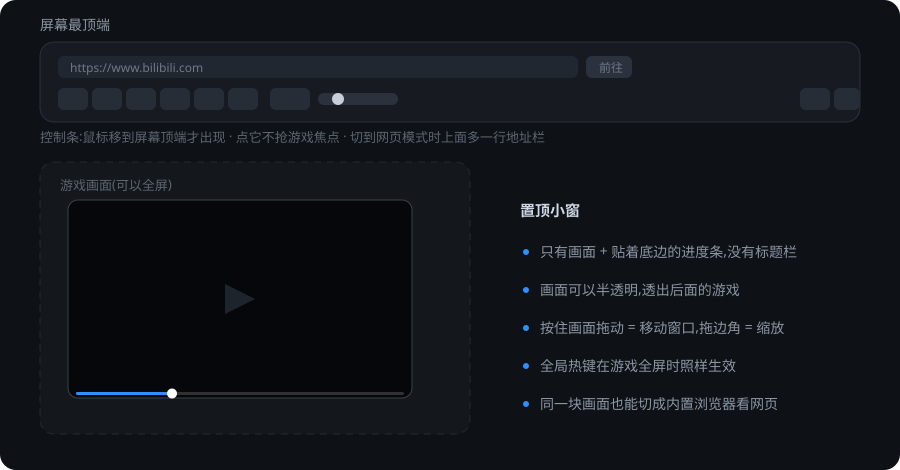

<div align="center">
  
  <h1>CheatSheet</h1>
  <p><strong>边玩游戏边看攻略的置顶小窗播放器。</strong></p>

  
  
  
  [](../../releases)
  [](LICENSE)
</div>

> 把攻略视频丢进一个置顶小窗,用全局热键随时控制 —— 不切窗口、不打断游戏操作。
> 本地视频和网页视频(B 站等)都能放。



## 特点

- **窗口只有画面和一条贴着底边的进度条** —— 没有标题栏、没有多余按钮
- **控制条浮在屏幕最顶端**,平时收起,**鼠标移上去停一下才出现**(默认 0.8 秒,设置里可调);
  点它不抢游戏焦点(带 `WS_EX_NOACTIVATE`),游戏不会被切出全屏
- **全局热键**在游戏全屏、窗口失去焦点时一样生效,而且**可以自己改键**(支持单键,如 `F5`)
- **画面可以半透明**,半透明时能透出后面的游戏画面(进度条也跟着一起淡)
- **也能直接当浏览器用**:内置网页模式带地址栏,看网页视频不用先下载
- **选集下拉栏**:网页模式列出 B 站**多P 视频的分P**(点一下切集),本地模式列出**播放列表**
- **不只是视频**:图片、Markdown / 文本笔记拖进来直接看 ——
  「攻略」里图文其实比视频多,所以它也是块**置顶小抄**
- **最近观看**:控制条上的「最近」下拉栏,**本地文件和网页混在一起**,每条都带着上次的进度
- **本地视频记住播放进度**:看到一半关掉,下次打开同一个文件接着看(设置里可以关)
- **单实例**:重复启动不会起第二个(把视频拖到 `CheatSheet.exe` 上会交给已经在跑的那个);
  真崩了会弹一个窗说明哪里出错、并把详情写到 `%AppData%\CheatSheet\crash-*.log`,然后干净退出
- 拖放即播、多文件播放列表(可**循环**)、倍速、音量、静音、透明度、等比例拖动

## 下载

到 [Releases](../../releases) 下载 `CheatSheet-v*-win-x64.zip`,解压后运行 `CheatSheet.exe`。

程序里也能检查更新:**设置 → 关于 → 检查更新**(默认启动时自动查一次,一天最多一次)。
发现新版本可以点「下载并更新」:它下载新包、解压到临时目录,然后**等程序退出后替换程序目录并自动重启**
—— Windows 上运行中的程序覆盖不了自己,所以由一个小脚本来接手。
替换失败会保留原程序、下次启动时提示,「打开下载页」也一直在。

> 需要 **.NET 10 桌面运行时**。网页模式还需要系统里的 **WebView2 运行时**(Win10 / 11 一般自带)。

## 用法

| 操作 | 怎么做 |
|---|---|
| 播放视频 | 把视频文件(或整个文件夹)**拖到窗口里**,或点控制条上的打开按钮 |
| 看图片 / 笔记 | 一样拖进来:图片和 `.md` / `.txt` 直接显示(多张可上下翻) |
| 继续上次看的 | 控制条上的**「最近」下拉栏**:本地文件是路径(带上次进度),网页是那个视频(带 `?p=N`,回到当初那一P) |
| 显示控制条 | 把鼠标移到**屏幕最顶端**并停一下(默认 0.8 秒,可在设置里改成一个立即 / 更久) |
| 移动窗口 | 在画面上按住拖动(网页模式下改成拖画面顶部那一条,见下文) |
| 调整窗口大小 | 拖窗口的边或角 |
| 调音量 | 在画面上滚轮,或控制条上的音量条 |
| 打开设置 | 控制条最右边的齿轮图标 |
| 选集 / 切分P | 控制条上的**下拉栏**(标题右边):网页模式是 B 站的分P,本地模式是播放列表 / 图片列表 |
| 上一集 / 下一集 | 控制条上的 ◀◀ / ▶▶(或 `Ctrl+Alt+↑` / `↓`):网页模式下切的是 B 站分P |
| 弹幕档位 | 网页模式下控制条上的**弹幕下拉栏**(按钮上写当前档:开启 / 精选 / 关闭) |
| 切画质 | 网页模式下控制条上的**清晰度下拉栏**(按钮上显示当前清晰度) |
| 切到网页模式 | 设置里选「浏览器」(不给快捷键,免得在游戏里误触) |

设置窗口里可以改:**画面透明度、音量、播放倍速、控制条出现延迟、全部全局热键、等比例拖动、循环播放、记住进度**。

## 默认全局热键

| 功能 | 热键 |
|---|---|
| 播放 / 暂停 | <kbd>Ctrl</kbd>+<kbd>Alt</kbd>+<kbd>Space</kbd> |
| 快退 | <kbd>Ctrl</kbd>+<kbd>Alt</kbd>+<kbd>←</kbd> |
| 快进 | <kbd>Ctrl</kbd>+<kbd>Alt</kbd>+<kbd>→</kbd> |
| 上一集 / 上一条 | <kbd>Ctrl</kbd>+<kbd>Alt</kbd>+<kbd>↑</kbd> |
| 下一集 / 下一条 | <kbd>Ctrl</kbd>+<kbd>Alt</kbd>+<kbd>↓</kbd> |
| 显示 / 隐藏播放窗口 | <kbd>Ctrl</kbd>+<kbd>Alt</kbd>+<kbd>T</kbd> |
| 画面透明度 − / + | <kbd>Ctrl</kbd>+<kbd>Alt</kbd>+<kbd>Z</kbd> / <kbd>Ctrl</kbd>+<kbd>Alt</kbd>+<kbd>X</kbd> |

**快进 / 快退的两种按法**:快速点一下 = 跳 5 秒;按住不放 = 切 2 倍速播放,松手恢复原来的倍速。

所有热键都能在设置里改,也支持不带 Ctrl/Alt 的单键。建议单键只给 `F1`-`F12` 这类功能键 —— 全局热键会抢占系统输入,绑成 `Space` 的话在任何程序里按空格都会被它截走。

## 网页模式

不想下视频、只想在网页上看攻略时,可以直接把小窗当浏览器用。默认首页是 `https://www.bilibili.com`(设置里可改)。

| 操作 | 怎么做 |
|---|---|
| 切进 / 切出 | 设置里选「浏览器」/「本地视频」(没有快捷键) |
| 打开别的网址 | 鼠标移到屏幕顶端调出控制条,在**按钮行上面那行地址栏**里输入网址后回车(`Esc` 取消) |
| 操作网页 | 直接用鼠标点画面 —— 点播放、拖进度条、全选字幕和在浏览器里一样 |
| 看进度 / 跳转 | 画面**底部那条进度条**;位置和总时长是从网页里那个视频读来的,点一下或直接拖都行 |
| 移动窗口 | 按住**画面顶部那一条**拖(中间有个小把手);本地视频模式仍然是拖整块画面 |
| 退出网页全屏 | `Esc` |

- 进入网页模式后会自动**点一下网站自己的「网页全屏」按钮**(B 站那个功能是纯 CSS 实现的,不是浏览器的全屏 API)。
  好处是画面真的铺满小窗,而且连它自己的控制条、弹幕层一起被抬到最上层 ——
  不会再出现"画面全屏了、上面还留一条 B 站白条"的情况。
- 地址栏(以及「首页」设置)可以**直接粘贴带文字的分享口令**(比如 B 站的「复制此链接」):
  里头的链接会被自动抠出来导航,不会被口令前后的文字带跑。
- 打开 **B 站多P 视频**时,控制条上的下拉栏会列出**全部分P**。点一下等于替你点了
  **播放器自己的选集项** —— 走的是站内切换,**页面不会重新加载**,所以网页全屏、
  播放进度都不会被打断(早先是"改网址 `?p=N` 重新导航",画面会闪一下白)。
  在页面里自己切集,下拉栏也跟着变;控制条的「上一集 / 下一集」在网页模式下同样是切分P。
- **播完自动接下一P**(本地播放列表那个自动续播的网页版);开着循环时,最后一P 播完会回到第一P。
- 控制条把播放器自己的**清晰度**和**弹幕档位**搬了出来 —— 切画质走「清晰度」下拉栏,
  弹幕走**自己的下拉栏**(开启 / 精选 / 关闭,按钮上就写着当前档),
  都不用再去点小窗里那套面板。需要登录 / 大会员的档位点了不会生效,那是网站自己的判断。
- 全局热键在网页模式下照样有效,而且**直接作用在网页里那个 `<video>` 上**:
  播放/暂停、快进/快退(点一下跳 5 秒、按住 = 2 倍速)、倍速、静音、音量、透明度。
- 设置里的「**暂停时**」处理方式对网页视频一样生效:页面里的视频一暂停,画面就跟着变暗 / 隐藏。
- 地址栏那条输入框需要键盘,而控制条本身是"点了不抢焦点"的窗口,所以**点进地址栏时会临时把前台抢过来**,
  打完字(回车 / `Esc` / 点别处)再把前台还给游戏。
- **退出网页模式(切回本地视频、或关窗口)会把内置浏览器整个关掉** —— 它背后是一组 Edge 进程,
  藏着不用也一直占内存和后台 GPU。代价是再切回来要重新加载页面:**地址会接着上次那个**
  (追的是哪一集,下拉栏里也写着),但播放位置不会保留。

## 从源码构建

```bash
git clone https://github.com/wkrs15/CheatSheet.git
cd CheatSheet
dotnet build
dotnet run
```

也可以直接把视频路径当参数传进去:

```bash
dotnet run -- "D:\videos\guide.mp4"
```

**技术栈**:C# / WPF / .NET 10 + [HandyControl](https://github.com/HandyOrg/HandyControl)(UI 主题)、`MediaElement`(本地视频)、
`WebView2CompositionControl`(网页模式)、Win32 `RegisterHotKey`(全局热键)。

> 网页模式必须用 Composition 版的 WebView2 —— 传统的 HwndHost 版在分层透明窗口里渲染不出来。
> 代价是它的鼠标命中测试在这种窗口里不生效,所以画面上的鼠标是由我们自己转发给浏览器的
> (见 `MainWindow.Web.cs` 里的说明)。

## 已知限制

- 播放引擎是 WPF 自带的 `MediaElement`,所以:
  - **2 倍速时没有声音**(底层变速会静音),切换瞬间也会卡一下;
  - `mkv` / `hevc` 等格式能否播放取决于系统装没装对应解码器;
- **不支持全屏**(最大化也会被自动还原)—— 目的是始终保持"小窗 + 控制条"这套形态。
- 网页模式下:
  - 画面**顶部那条**(拖窗口)和**底部那条**(进度条)是 app 自己的,那两条里的网页内容点不到 ——
    所以 B 站自己的控制条如果正好压在底部那条上,建议用 `Esc` / 顶部区域的按钮,或者干脆用我们的进度条和热键;
  - 画面上的**滚轮仍然是调 app 音量**(没有转给网页),需要滚轮滚动的网页得用系统浏览器;
  - 网页里的**输入框(搜索框、发弹幕)还没有做键盘转发** —— 要打字请用系统浏览器;
  - 需要联网 + 系统里的 **WebView2 运行时**(Win10/11 一般自带)。

## 发布新版本

推一个 `v*` 标签,GitHub Actions 会自动构建并发布 Release:

```bash
git tag v0.2
git push origin v0.2
```

## 更新日志

每个版本改了什么见 [CHANGELOG.md](CHANGELOG.md) —— 发版时它会自动被用作 Release 说明。

## 许可

本项目基于 [MIT](LICENSE) 协议开源。
